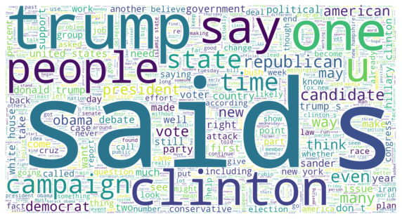
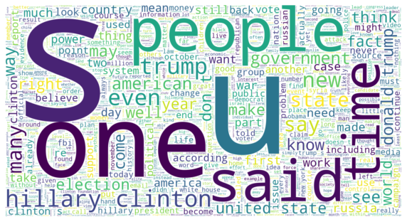
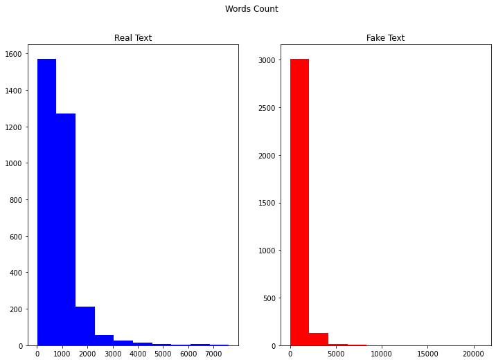
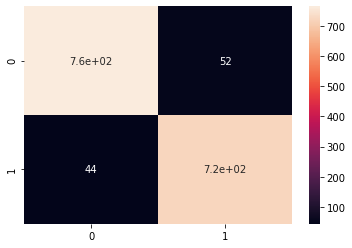

# Fake News Detector
* Visualized and analyzed a dataset of US politically related real and fake news
* Used a TFIDF Vectorizer to dissect the text in articles to establish a correlation between vocabulary and frequency of words
* Finalized a script to test whether an article if real or fake

# Resources Used
* Python 3.7
* Jupyter Notebook
* Packages: pandas, numpy, sklearn, matplotlib, seaborn, pickle

# EDA
Within the python notebook, I visualized the texts between real and fake. Here are some highlights:

**Real News Wordcloud**

**Fake News Wordcloud**

**Word Count Distribution Per Article**

# Model Building
* Model buliding was simply done in two parts
  * Initialized and fitted a TFIDF Vectorizer to remove stopwords and words that too frequently appeared in most documents
  * Train a PassiveAggressiveClassifer on the TFIDF vector for accurate classification
* The model proved to be almost completely accurate on this simple setup. Tuning the hyperparameters proved to be of little use.

# Model Performance
* The model displayed strong results with an accuracy of ~94% on the validation data
* There were 760 True Negatives, 720 true positives, 44 false negatives, and 52 false negatives.

**Confusion Matrix**

# Classifying External Articles
* Currently, running an model_test.py with the main string edited to be your article of chose should return a classification of real or fake
